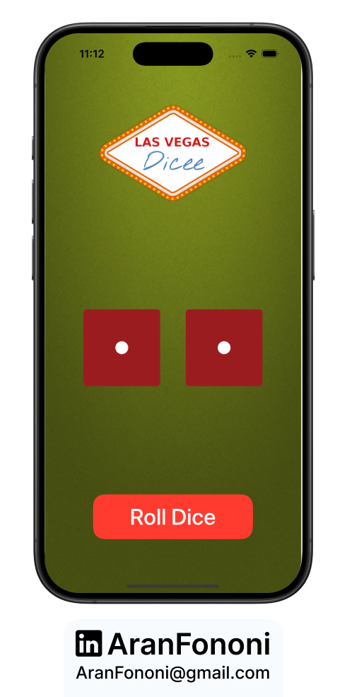
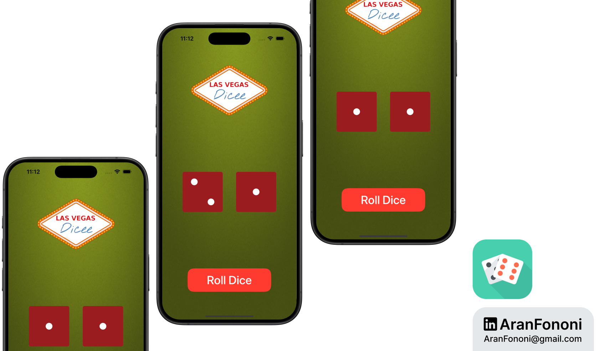

# Dicee

### Project for Section 17: **Dice Rolling App**  
This project was completed as part of Section 17 in the **Complete iOS Development Bootcamp** by Angela Yu.

## Project Overview
**Dicey** is a simple yet fun dice rolling application created entirely with SwiftUI. The app allows users to roll two dice and display the results on the screen, providing an engaging user experience.

## What I Learned
In this project, I focused on:
- **SwiftUI Fundamentals**: Gained hands-on experience with SwiftUI for building user interfaces.
- **State Management**: Utilized @State properties to manage the state of the dice numbers and update the UI accordingly.
- **Animations and Layouts**: Implemented responsive layouts and animations to enhance user interaction.

## Key Skills
- Proficient in creating views and layouts using SwiftUI
- Experience with managing state in SwiftUI applications
- Understanding of how to use images and buttons in SwiftUI

## Additional Features
- Intuitive design with an interactive button to roll the dice.
- Customizable dice images that change based on the rolled number.

---

### Project Preview

---

### Footer

---

## Contact
For more information, feel free to reach out:  
- **Email**: [aranfononi@gmail.com](mailto:aranfononi@gmail.com)  
- **LinkedIn**: [Aran Fononi](https://www.linkedin.com/in/aran-fononi-18182b265)
